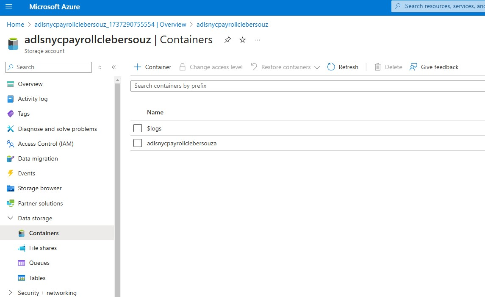

under construction...

# Data Integration Pipelines for NYC Payroll Data Analytics

Author: [Cleber Zumba](https://github.com/cleberzumba)

Last Updated: January 22, 2025

## What is this project for?

New York City would like to develop a data analytics platform on Azure Synapse Analytics to achieve two main goals:

1- Analyze how the city’s financial resources are allocated and how much of the city’s budget is being dedicated to overtime.

2- Make the data available to the interested public to show how the city’s budget is being spent on salaries and overtime for all city employees.

As a Data Engineer, I need to create high-quality data pipelines that are dynamic, can be automated, and monitored for efficient operation. The project team also includes the city’s quality assurance specialists who will test the pipelines to find any errors and improve the overall data quality.

The source data resides in Azure Data Lake and needs to be processed in a NYC data warehouse. The source datasets consist of CSV files with employee master data and monthly payroll data entered by various city agencies.

I used Azure Data Factory to create Data views in Azure SQL DB from the source data files in DataLake Gen2. Then I built the dataflows and pipelines to create payroll aggregated data that will be exported to a target directory in DataLake Gen2 storage over which Synapse Analytics external table is built. At a high level, my pipeline will look like the one below

## Project Environment

This project was done in the Azure Portal, using several Azure resources, including:

  - Azure Data Lake Gen2
  - Azure SQL DB
  - Azure Data Factory
  - Azure Synapse Analytics

## Prepare the Data Infrastructure

### 1.Create the data lake and upload data

Create an Azure Data Lake Storage Gen2 (storage account) and associated storage container resource

Create three directories in this storage container named

- `dirpayrollfiles`
- `dirhistoryfiles`
- `dirstaging`

`dirstaging` will be used by the pipelines we will create as part of the project to store staging data for integration with Azure Synapse.

Upload these files from the project data to the dirpayrollfiles folder

- EmpMaster.csv
- AgencyMaster.csv
- TitleMaster.csv
- nycpayroll_2021.csv

Upload this file (historical data) from the project data to the `dirhistoryfiles` folder

- nycpayroll_2020.csv

### 2. Create an Azure Data Factory Resource

### 3. Create a SQL Database

### 4. Create a Synapse Analytics workspace

### 5. Create summary data external table in Synapse Analytics workspace

The external table references the `dirstaging` directory of DataLake Gen2 storage for staging payroll summary data.

### 6. Create master data tables and payroll transaction tables in SQL DB

- Employee Master Data table
- Job Title Table
- Agency Master table
- Payroll 2020 transaction data table
- Payroll 2021 transaction data table
- Payroll summary data table

## Create Linked Services

### 1.Create a Linked Service for Azure Data Lake and a Linked Service to SQL Database that has the current (2021) data.

## Create Datasets in Azure Data Factory

### 1. Create the datasets for the 2021 Payroll file on Azure Data Lake Gen2 and for all the data tables in SQL DB

### 2. Create the datasets for destination (target) table in Synapse Analytics

## Create Data Flows

In Azure Data Factory, I created data flow to load 2020 Payroll data from Azure DataLake Gen2 storage to SQL db table created earlier

